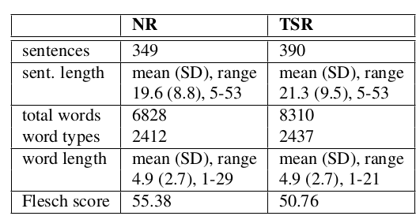

# working_with_ZuCo_EEG_dataset
This tutorial explains the preprocessing steps applied to EEG data in the studies “[ZuCo](https://www.nature.com/articles/sdata2018291): A Simultaneous EEG and Eye-Tracking Resource for Natural Sentence Reading, and "[ZuCo 2.0](https://arxiv.org/abs/1912.00903): A dataset of physiological recordings during natural reading and annotation". 

ZuCo v.1 is a dataset combining EEG and eye-tracking recordings from subjects reading natural sentences. Eye-tracking makes it possible to mark the exact boundaries of each word as a subject reads a sentence, which in turn allows precise extraction of the corresponding EEG signals for every word.
Main features:
1. Subjects: 12 healthy adult native speakers
2. Schematic overview of the three tasks in  the study design. [Source](https://www.nature.com/articles/sdata2018291)

  

The reading materials contain sentences from movie reviews from the Stanford Sentiment Treebank and biographical sentences about notable people from the Wikipedia relation extraction corpus.
- Sentences from the Stanford Sentiment Treebank: 123 neutral, 137 negative, and 140 positive sentences. Total sentences: 400
- Sentences from the Wikipedia relation extraction dataset for the Normal Reading (NR) task: 300
- Sentences from the Wikipedia relation extraction dataset for the task-specific relation task: 407
4. Procedure: The sentences were presented to the subjects in a naturalistic reading scenario, where the complete sentence was presented on the screen and the subjects read each sentence at their own speed.

ZuCo v.2 is an extended dataset of ZuCo v.1 with more sentences and more subjects. 
Main features:
1. Subjects = 18 healthy adult  native speakers.
2. Tasks = Normal reading (NR), in which participants read the sentences naturally, without any specific tasks other than comprehension; and task-specific reading paradigm, in which they have to determine whether a certain relation type occurred in the sentence.
3. Descriptive Statistics of the Reading Materials. [Source](https://arxiv.org/abs/1912.00903)

4. 

  

5. There is an overlap between ZuCo v.1 and ZuCo v.2. 100 normal reading and 85 task-specific sentences recorded for this dataset were already recorded in the version 1.
6. Procedure: Same as 

  

## Eye-tracking preprocessing and Feature extraction for both datasets:
The EyeLink 1000 tracker processes eye-position data, identifying saccades, fixations, and blinks. 
   -Fixation: Fixation occurs when the eyes stay relatively still on a specific place.-> In the dataset it consists of time periods without saccades. 
   -Saccades: A saccade is a rapid eye movement from one point of fixation to another.

**FEATURES**: 1. Gaze duration (GD): The sum of all fixations on the current word in the first-pass reading before the eyes move out of the word 
              2. Total reading time (TRT): The sum of all fixation durations on the current word, including regressions. 
              3. First fixation duration (FFD): The duration of the first fixation on the prevailing word.
              4. Single fixation duration (SFD): The duration of the first and only fixation on the current word. 
              SFD only applies to words that are never refixated; if a word has multiple fixations, it does not have an SFD
              5. Go-past time (GPT): GPT measures all the time a reader spends on a word and any time spent going back to earlier 
              words before moving forward past the current word.

## EEG acquisition in both  datasets:

- System = 128-channel EEG Geodesic Hydrocel system (Electrical Geodesics, Eugene, Oregon).
- Sampling rate: The data was recorded at a sampling rate of 500 Hz with a bandpass of 0.1 to 100 Hz.
- Recoding Reference: all EEG channels were measured relative to the voltage at the Cz electrode (top center of the scalp).

### EEG preprocessing steps and Feature extraction

- 105 EEG channels were used for scalp recordings, and 9 EOG channels, which measure the electrical activity generated by eye movements, were used for artifact removal.
- The rest of the channels lying mainly on the neck and face were discarded before the data analysis.
- Bad electrodes, such as flatline, low-frequency, or noisy channels, were identified and replaced. An electrode was considered bad if its recorded signal correlated less than 0.85 with an estimate derived from the remaining channels. Furthermore, a channel was defined as a bad channel if it had more line noise relative to its signal compared to all other channels (4 standard deviations). Finally, if a channel had a longer flatline than 5 s, it was considered bad.
- EEG data were high-pass filtered at 0.5 and notch filtered (49-51 Hz) with a Hamming windowed sinc finite impulse response zero-phase filter.
- Eye artifacts were removed by linearly regressing the EOG channels from the scalp EEG channels.
- The Multiple Artifact Rejection Algorithm ( MARA) is used for automatic rejection of artifacts.
- Bad electrodes were interpolated by using spherical spline interpolation.
- After automatic scanning, noisy channels were selected by visual inspection and interpolated.

  **Feature Extraction**:

  Oscillatory power in different frequency bands: It refers to the magnitude of rhythmic neural activity within specific frequency ranges of brain signals.
  Neural oscillations are repetitive patterns of neural activity measurable across frequency bands. Each band is associated with a different cognitive or physiological state.

  In this study, oscillatory power measures were computed by band-pass filtering the continuous EEG signals across the entire task period (full duration of the task) for five distinct frequency bands, resulting in a time series for each band. The frequency bands analyzed are as follows:

  - Theta 1 (4-6) Hz, Theta 2 (6.5-8) Hz ---> It is linked to creativity, intuition, daydreaming, and fantasizing, and is a repository for memories, emotions, sensations.
  - Alpha 1 (8.5-10) Hz, Alpha 2 (10.5 -13) Hz ---> Linked to attention, mental imagery,  and perception.
  - Beta 1 (13.5-18) Hz, Beta 2 (18.5 -30) Hz ---> Linked to cognitive-task engagement.
  - Gamma 1 (30.5-40 Hz), Gamma 2 (40-49.5) Hz --->  Linked to higher cognitive functions, such as attention, memory encoding, sensory perception, and emotion integration.
 
Then, a Hilbert Transform is applied to each of these time series (bands). The Hilbert transformation maintains temporal information for the amplitude of the frequency bands. This temporal resolution is important because the EEG features need to be aligned with time segments defined by the eye-tracking fixations.

  

  
   
   

   
   

