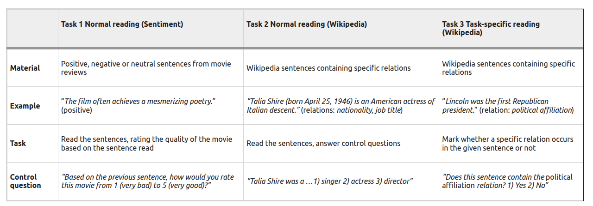

# working_with_ZuCo_EEG_dataset
This tutorial explains the preprocessing steps applied to EEG data in the studies “[ZuCo](https://www.nature.com/articles/sdata2018291): A Simultaneous EEG and Eye-Tracking Resource for Natural Sentence Reading, and "[ZuCo 2.0](https://arxiv.org/abs/1912.00903): A dataset of physiological recordings during natural reading and annotation". 

ZuCo v.1 is a dataset combining EEG and eye-tracking recordings from subjects reading natural sentences. 
Main features:
1. Subjects: 12 healthy adult native speakers
2. Schematic overview of the three tasks in  the study design. [Source](https://www.nature.com/articles/sdata2018291)

   
   

